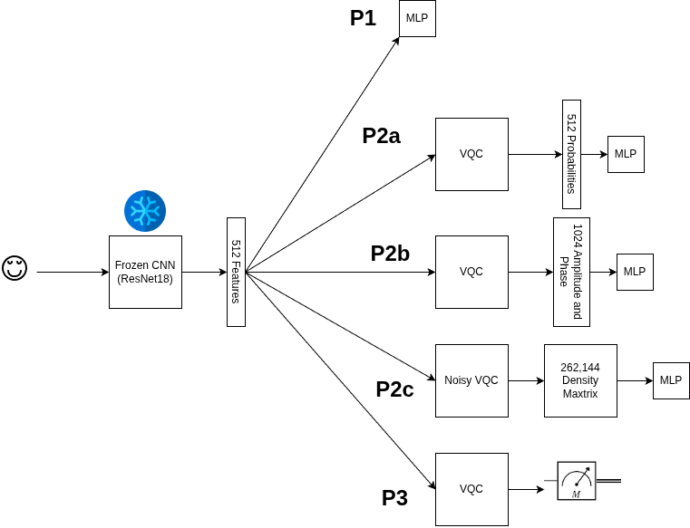

# Quantum Feature Refraction: Can Variational Quantum Circuits Enhance Classical Features and Leverage NISQ-Era Noise as Regularization?

**Final Project – ELEC/PHYS 5678 Quantum Computing (Fall 2025)**  
University of Colorado Denver

This repository accompanies the final project paper for ELEC/PHYS 5678.  
We study hybrid classical–quantum learning pipelines that insert a variational quantum circuit (VQC) into a conventional deep learning workflow for medical image classification.

---

## Project Overview

**Research Question**  
Can variational quantum circuits improve the separability of features extracted by a classical convolutional neural network, and can NISQ-era noise act as a useful form of regularization?

We evaluate several hybrid pipelines combining a frozen ResNet18 feature extractor with a VQC used either as:
- a **feature transformer**, or
- a **direct classifier**,

and compare them against purely classical baselines.

---

## Pipeline Architecture

The full hybrid pipeline evaluated in this work is illustrated below.

A ResNet18 backbone extracts fixed classical features, which are optionally passed through a variational quantum circuit. Depending on the pipeline, the VQC outputs probabilities, complex amplitudes, density matrices, or direct class predictions, which are then consumed by a classical multi-layer perceptron (MLP).

---

## Abstract (Summary)

This work investigates whether variational quantum circuits (VQCs) can enhance the separability of features extracted from a convolutional neural network (CNN). A parameterized VQC is inserted between a frozen ResNet18 and a classical classification head, and multiple quantum representations are extracted, including probability amplitudes, full complex statevectors, and full density matrices.  

To study robustness and practical behavior, we explicitly inject noisy intermediate-scale quantum (NISQ) noise—bit-flip, amplitude damping, and depolarizing channels—directly into the VQC. This enables controlled evaluation of how different noise processes affect classification performance and whether noise can function as a form of regularization analogous to dropout.  

Experiments are conducted on the RetinaMNIST and PneumoniaMNIST datasets. The results provide empirical insight into when VQCs can enrich classical feature representations and clarify the extent to which NISQ-era noise can be exploited constructively in hybrid quantum–classical learning systems.

---

## Results Summary

Key findings from the experiments include:

- **Classical vs. Quantum Classifiers**  
  A direct comparison between a classical MLP classifier and a VQC classifier shows a clear advantage for the classical model. This gap is largely explained by parameter count: the classical MLP contains over 130k parameters, whereas the VQC classifier has only 20 trainable parameters.

- **Quantum Feature Enhancement (Noiseless)**  
  When the VQC is used as a feature transformer rather than a classifier, providing the **full complex quantum amplitudes** consistently improves performance compared to probability-only features. These models also exhibit substantially reduced variance across runs, suggesting improved feature stability.

- **Noise as Regularization**  
  When extracting full density matrices from noisy VQCs, quantum noise acts as an adaptive regularizer. Optimal noise levels depend on dataset size and task difficulty, with all three noise types achieving similar peak performance when properly tuned.

- **Best-Performing Hybrid Pipeline**  
  The strongest overall performance is achieved when a noisy VQC acts as a feature extractor and passes the full density matrix to the MLP. In this configuration, the hybrid model slightly exceeds the classical baseline on average. However, this result is confounded by a dramatic increase in the number of classical parameters, and statistical significance does not consistently reach the 0.05 threshold.

---

## Conclusions and Limitations

This study provides evidence that VQCs can generate linearly separable internal representations. However, only a small fraction of this information is accessible through physically realizable measurements—typically via a single qubit. As a result, practical VQC classifiers are unable to exploit the internal structure that classical classifiers can access in simulation.

These results suggest that **measurement, rather than expressivity, may be the dominant bottleneck** for NISQ-era quantum machine learning. While VQCs can enrich feature representations in simulation, extracting this information in a physically realizable way remains an open challenge.

Future work should focus on:
- controlling for parameter count across pipelines,
- improving statistical power with additional datasets,
- and developing measurement strategies that better expose the structure of quantum representations.

---

## Repository Contents

- `src/` – Model definitions, training scripts, and quantum circuit implementations  
- `analyses/` – Analysis scripts and plotting utilities  
- `results/` – Experimental outputs (metrics, predictions, plots; **checkpoints excluded**)  
- `graphics_misc/` – Figures used in the paper and README  
- `README.md` – Project overview (this file)

---

## Full Paper

For complete methodological details, statistical analyses, and discussion, please see the full paper:

**Quantum Feature Refraction: Can Variational Quantum Circuits Enhance Classical Features and Leverage NISQ-Era Noise as Regularization?**  
📄 `PHYS 5678 Final Project Fall 2025.pdf`

---

## Notes

- Model checkpoints (`.pth`) are intentionally excluded from version control due to size.
- All experiments were run multiple times to assess variance and robustness.
- This repository is intended for academic reproducibility and course submission.

---

## Author

Christopher Clark  
University of Colorado Denver
