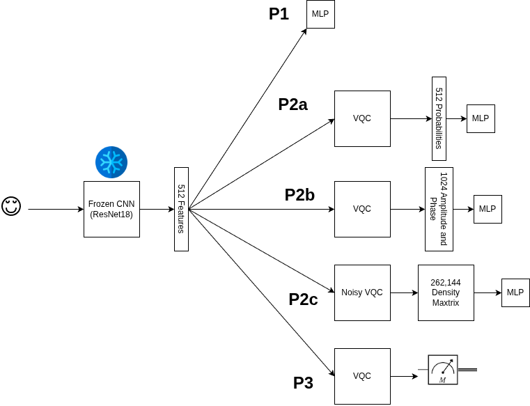

# Quantum-Classical Hybrid Machine Learning for Medical Image Classification

**Final Project - ELEC/PHYS 5678 Quantum Computing Fall 2025 at the University of Colorado Denver**

This project explores hybrid classical-quantum machine learning pipelines for binary medical image classification using MedMNIST datasets. We implement and compare multiple architectures that combine classical convolutional neural networks (CNNs) with variational quantum circuits (VQCs).

---

## Project Overview

**Research Question:** Can quantum feature extraction improve medical image classification compared to classical approaches?

**Key Findings:**
- **Quantum-Classical Parity**: Best quantum models achieve comparable performance to classical baselines (no significant difference)
- **Phase Information Critical**: Complex amplitude features (P2b) consistently outperform probability-only features (P2a)
- **Noise as Regularization**: Optimal noise levels vary by task difficulty (low noise for easy tasks, moderate for hard tasks)
- **Feature Extraction >> Direct Classification**: Full quantum state extraction (P2d) dramatically outperforms single-qubit measurement (P3)
- **Training Dynamics Matter**: Discovered and fixed critical dual learning rate issue that caused P2 pipeline failure

---

### Pipeline Architecture



*Figure 1: Overview of the three main pipeline architectures - P1 (Classical), P2 (Quantum Feature Extraction), and P3 (Quantum Direct Classification)*

## Architecture Pipelines

### Pipeline 1 (P1): Classical Baseline
```
ResNet18 (frozen) → Dropout → MLP Classifier
```
- **Purpose**: Establish classical performance baseline
- **Features**: 512 classical features from ResNet18
- **Key Finding**: Performs best with no dropout (p=0.0)

### Pipeline 2 (P2): Quantum Feature Extraction
```
ResNet18 (frozen) → VQC → Quantum Features → MLP Classifier
```

**Variants:**
- **P2a**: Probability features |α|² (512 features, no noise)
- **P2b**: Complex amplitudes Re(α) + Im(α) (1,024 features, no noise)
- **P2c**: Full density matrix ρ (262,144 features, WITH noise)

**Key Finding**: P2b's phase information provides significant performance boost over P2a

### Pipeline 3 (P3): Quantum Direct Classification
```
ResNet18 (frozen) → VQC → Single Qubit Measurement → Probabilities
```
- **Purpose**: Direct quantum classification without classical MLP
- **Features**: 2 class probabilities from first qubit measurement
- **Key Finding**: Underperforms P2 variants due to information loss

---

## Datasets

All experiments use **MedMNIST** binary classification tasks:

| Dataset | Task | Train Size | Image Type | Difficulty |
|---------|------|------------|------------|------------|
| **RetinaMNIST** | Diabetic retinopathy (0 vs 3+4) | ~520 | RGB fundus | Baseline |
| **BreastMNIST** | Breast ultrasound (benign vs malignant) | 546 | Grayscale | Small dataset |
| **PneumoniaMNIST** | Chest X-ray (normal vs pneumonia) | 4,708 | Grayscale | Large dataset |

---

## Project Structure

```
src/
├── loader.py                      # Unified MedMNIST data loader
├── model.py                       # Hybrid CNN-VQC architectures (P1, P2, P3)
├── train.py                       # Training with dual learning rates
├── run_all_experiments.sh         # Experiment launcher for all pipelines
├── statistical_analysis.py        # 7 hypothesis tests with p-values
├── visualize_analysis.py          # Comprehensive result visualizations
├── explore_medmnist_datasets.py   # Dataset exploration & visualization
├── draw_vqc.py                    # VQC circuit diagram generator
└── troubleshooting_scripts/
    ├── analyze_quantum_features.py    # Feature separability analysis
    └── compare_quantum_features.py    # P2 vs P3 comparison
```

---

## Key Technical Details

### VQC Architecture (9 qubits, 2 layers)
- **Encoding**: Amplitude embedding (512 amplitudes from 2^9 states)
- **Ansatz**: RY rotations + ring CNOT entanglement
- **Optimization**: Adam optimizer with dual learning rates
  - Quantum parameters: LR = 0.1
  - Classical MLP: LR = 0.001

### Critical Discovery: Dual Learning Rate Fix
**Problem**: P2 pipelines initially achieved AUC ~0.54 (random guessing)

**Root Cause**: MLP head was incorrectly using quantum learning rate (0.1), causing training instability

**Solution**: Implemented separate optimizers:
```python
optimizer_quantum = Adam(vqc_params, lr=0.1)
optimizer_classical = Adam(mlp_params, lr=0.001)
```

**Result**: P2 performance jumped from 0.54 → 0.84-0.92 (70% improvement)

---

## Experimental Results

### Cross-Dataset Performance (Best Configurations)

| Pipeline | RetinaMNIST | PneumoniaMNIST | Description |
|----------|-------------|----------------|-------------|
| **P1 (Classical)** | 0.873 ± 0.006 | 0.938 ± 0.005 | Dropout p=0 |
| **P2a (Probabilities)** | 0.776 ± 0.079 | 0.855 ± 0.069 | 512 features |
| **P2b (Complex Amps)** | 0.842 ± 0.028 | 0.919 ± 0.010 | 1,024 features |
| **P2d (Density Matrix)** | 0.870 ± 0.014 | 0.942 ± 0.005 | 262k features, optimal noise |
| **P3 (Direct)** | 0.806 ± 0.093 | 0.720 ± 0.066 | Single qubit measurement |

### Statistical Tests (7 Hypothesis Tests)
1. **P1 vs P3**: Classical significantly better (p < 0.001)
2. **P2a vs P2b**: Complex amplitudes significantly better (p = 0.010-0.023)
3. **P2d Noise Sweep**: Optimal noise varies by task (p=0.01 easy, p=0.05-0.1 hard)
4. **P1 Dropout Sweep**: Optimal dropout = 0.0 for both datasets
5. **Best P2 vs P3**: Feature extraction >> direct classification (gap: 9-22%)
6. **Noise Types**: All three noise types (bit flip, amp damp, depol) achieve similar optimal performance
7. **Best Classical vs Best Quantum**: No significant difference between best classical and best quantum (p > 0.05), though they did get close to this threshold

---

## Key Scripts Usage

### 1. Run Full Experimental Suite
```bash
bash run_all_experiments.sh \
    --dataset retinamnist \
    --results_dir ./results \
    --n_runs 10 \
    --pipelines all
```

### 2. Statistical Analysis
```bash
python statistical_analysis.py \
    --results_dir ./results/results_retinamnist_n10_dual_lr \
    --output_dir ./analysis
```

Generates:
- 7 hypothesis test plots (p-values displayed)
- Statistical summary (JSON + Markdown)
- Effect sizes (Cohen's d)

### 3. Visualize Results
```bash
python visualize_analysis.py \
    --results_dir ./results/results_retinamnist_n10_dual_lr \
    --output_dir ./analysis
```

### 4. Explore Datasets
```bash
python explore_medmnist_datasets.py \
    --save_dir ./graphics
```

### 5. Draw VQC Circuits
```bash
# Clean circuit
python draw_vqc.py \
    --vqc_type basic \
    --num_layers 2 \
    --n_qubits 9 \
    --output circuit.png

# With noise
python draw_vqc.py \
    --vqc_type basic \
    --num_layers 2 \
    --n_qubits 9 \
    --noise depol \
    --noise_prob 0.01 \
    --output circuit_noisy.png
```

### 6. Analyze Quantum Feature Separability
```bash
python troubleshooting_scripts/analyze_quantum_features.py \
    --model_path ./results/.../p2b_complex_amplitudes/run_1 \
    --dataset retinamnist \
    --save_dir ./analysis/features \
    --n_samples 100
```

### 7. Compare P2 vs P3 Separability
```bash
python troubleshooting_scripts/compare_quantum_features.py \
    --model1_path ./results/.../p2b_complex_amplitudes/run_1 \
    --model2_path ./results/.../p3_no_noise/run_1 \
    --model1_name "P2b (Complex Amplitudes)" \
    --model2_name "P3 (Direct Classification)" \
    --dataset retinamnist \
    --save_dir ./comparison
```

## Dependencies

```bash
pip install torch torchvision pennylane medmnist numpy pandas matplotlib seaborn scipy scikit-learn tqdm
```

**Key versions:**
- Python 3.8+
- PyTorch 1.13+
- PennyLane 0.30+
- MedMNIST 2.2+

---

## Results Directory Structure

```
results/
└── results_{dataset}_n10_dual_lr/
    ├── p1_classical_dropout_0.0/
    │   ├── run_1/
    │   │   ├── config.json
    │   │   ├── best_model.pth
    │   │   ├── metrics.json
    │   │   └── training_log.txt
    │   ├── run_2/
    │   └── ...
    ├── p2a_probabilities/
    ├── p2b_complex_amplitudes/
    ├── p2d_density_matrix_{noise_type}_{noise_level}/
    ├── p3_no_noise/
    └── p3_{noise_type}_{noise_level}/
```

---

## Citation

If you use this code, please cite:

```bibtex
@misc{qml_medical_imaging_2025,
  title={Quantum Feature Refraction: Can Variational Quantum Circuits Enhance Classical Features and Leverage NISQ-Era Noise As Regularization?},
  author={[Christopher Clark]},
  year={2025},
  note={Final Project - ELEC/PHYS 5678 Quantum Computing Fall 2025 at the University of Colorado Denver}
}
```

---

## License

This project is for educational purposes as part of a graduate quantum computing course.

---

## Acknowledgments

- **MedMNIST**: Yang et al. (2023) - https://medmnist.com
- **PennyLane**: Xanadu Quantum Technologies
- **PyTorch**: Facebook AI Research

---

## Contact

For questions about this project, please contact [christopher.w.clark@cuanschutz.edu].

---

**Last Updated**: December 2025